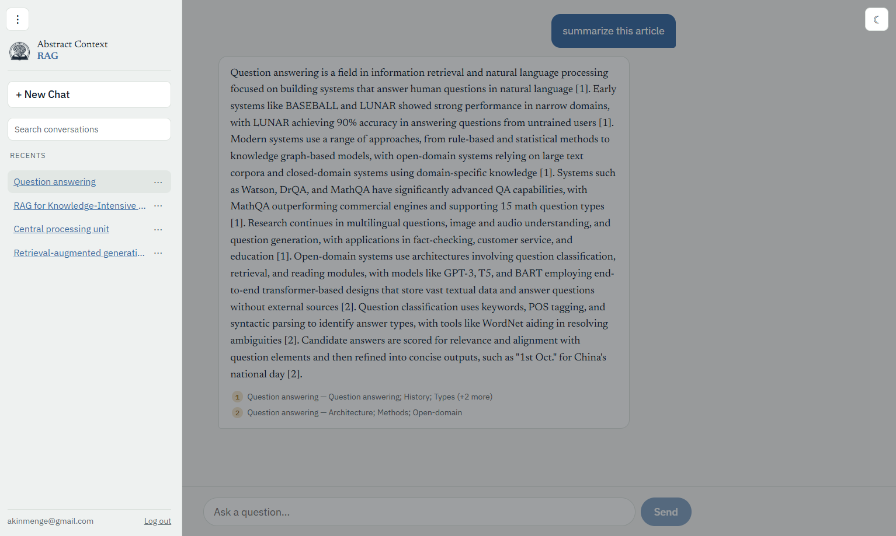
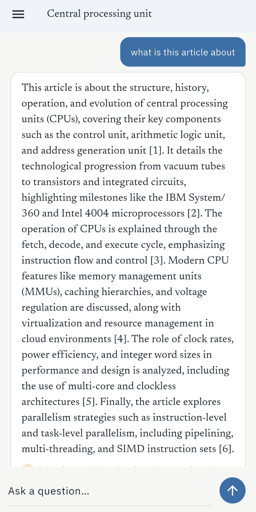

<p align="center">
  
</p>

<h1 align="center">abstract-context-rag</h1>

<p align="center">
  A local, modular Retrieval-Augmented Generation system for asking questions about
  and summarizing research papers and Wikipedia articles - every answer cited down
  to the page or section, and checked against its source before it's shown.
</p>

<p align="center">
  
  
  
  
</p>

---

This is a learning project, built end to end from scratch: every retrieval technique
below (hybrid search, reranking, RAPTOR summary trees, corrective/multi-hop agents,
citation verification, an evaluation harness) was implemented and measured one at a
time, not assembled from a framework. It also doubles as a portfolio piece - the
goal was never just "a RAG demo that works," but one where every claim about it is
backed by a number. [docs/roadmap.md](docs/roadmap.md) is the full build log: what
was tried, what was measured, and what didn't work.

## Table of contents

- [At a glance](#at-a-glance)
- [What is this](#what-is-this)
- [Key features](#key-features)
- [Tech stack](#tech-stack)
- [Architecture and project layout](#architecture-and-project-layout)
- [Getting started](#getting-started)
- [Docker](#docker)
- [API and CLI reference](#api-and-cli-reference)
- [Web (React)](#web-react)
- [Mobile (Flutter)](#mobile-flutter)
- [Testing](#testing)
- [Configuration](#configuration)
- [Documentation map](#documentation-map)
- [Status](#status)
- [License](#license)

## At a glance

| | |
|---|---|
| **Status** | MVP complete - see [Status](#status) |
| **Backend** | FastAPI + a plain-Python RAG engine, 326 tests, ruff clean |
| **Clients** | React web app, Flutter mobile app (Android + Windows desktop) - same accounts, same chat history |
| **Runs on** | Consumer hardware, 6 GB VRAM: Qwen3-4B-Instruct (Q4_K_M GGUF) via Ollama, Qdrant, local embedding/reranking |
| **License** | MIT |

## What is this

Point it at an arXiv paper (by ID or PDF upload) or a Wikipedia article, and ask it
questions or ask it to summarize. Every answer is grounded in the retrieved text,
cited `[1] [2]`-style down to the page or section it came from, and passed through a
verification step that checks each cited sentence against the passage it points to.
If the source doesn't contain the answer, it says so instead of guessing.

It was built for two reasons at once:

1. **Learn RAG by building every piece of it.** Not "call LangChain and see what
   happens" - implement hybrid retrieval, reranking, RAPTOR, agentic retrieval and
   citation verification one at a time, and measure what each one actually adds
   before moving to the next. [docs/roadmap.md](docs/roadmap.md) has the numbers
   behind every technique below.
2. **End up with something real to show.** A working chatbot with accounts, chat
   history, a web client and a mobile client, backed by a system whose accuracy
   claims are measured rather than asserted.

It's a single-user, LAN-scale project by design - see [Status](#status) for what
that does and doesn't mean for deploying it further.

## Key features

- **Ingestion.** arXiv ID or direct PDF upload (section-aware parsing via Docling)
  and Wikipedia articles (by title or URL), through one shared `ingest()` entry
  point - the CLI, the API and the evaluation harness all call the same function,
  never separate paths for "automated" vs "manual" ingestion.
- **Hybrid retrieval.** Dense (bge-m3) and sparse search, fused with Reciprocal Rank
  Fusion, so exact terms and semantic matches both have a shot at the top of the
  list.
- **Cross-encoder reranking**, plus a score threshold that abstains *before* the LLM
  is ever asked - the cheapest and most reliable place to say "I don't know."
- **Grounded generation** with numbered citations and lost-in-the-middle-aware
  context ordering (the most relevant chunks are placed where the model actually
  reads them, not buried in the middle).
- **Citation verification.** A model citing a source doesn't mean the source
  actually supports the claim - each generated sentence is checked against the
  passage it cites, and unsupported claims are flagged rather than silently kept
  or deleted.
- **Whole-document questions** ("summarize this paper") are answered from a RAPTOR
  summary tree built at ingest time (or map-reduce as a fallback), routed there
  automatically by a keyword-based query router - no extra LLM round-trip spent
  classifying the question first.
- **Corrective and multi-hop retrieval agents** for questions that span more than
  one document or need a follow-up search to answer.
- **An evaluation harness**, not a vibe check: golden question sets across six
  papers and two Wikipedia articles (specific, comparison, multi-hop, abstain and
  whole-document questions), scored on recall@k, MRR, evidence recall, abstain
  accuracy, LLM-judged faithfulness and accuracy, time per question, and ablation
  tables comparing retrieval modes. This is what turns "I added reranking" into
  "reranking cut retrieval failures from X to Y."
- **Accounts and persisted chat history.** Email+password accounts (JWT bearer
  tokens), conversations and messages in a small SQLite database, scoped per user -
  while ingested documents stay one shared pool, so a paper ingested once is
  reusable by every conversation, never re-ingested per user. Recent turns are
  spliced into the generation prompt so a follow-up question ("so how does that
  work?") resolves against what was just discussed, without re-retrieval or query
  rewriting.
- **A React web client** and **a Flutter mobile client** sharing the same JWT
  bearer API - a conversation started on web continues on mobile. See
  [Web](#web-react) and [Mobile](#mobile-flutter) below.
- **A fine-tuning attempt that didn't pan out**, and is written up as a negative
  result instead of hidden: 465 verified SFT examples generated from real ingested
  chunks, trained on Kaggle (LoRA/QLoRA), merged and converted to GGUF - measured
  against the base model on the full golden set, it regressed. The root cause (a
  skewed abstain ratio in the training set, not a model-size or infrastructure
  problem) is in docs/roadmap.md, "Phase 8" and "Phase 8 continued". The scripts
  themselves were local-only and were never committed - this write-up is the
  record of what was done, not the code.

**Planned next:** question-time figure understanding (a retrieved figure described
against the user's actual question rather than one fixed caption written at ingest
time - already prototyped, off by default) and fine-tuned embedding/reranker
models. Both, with what's already been measured, are in
[docs/roadmap.md](docs/roadmap.md).

## Tech stack

| Layer | Choice | Why |
|---|---|---|
| Vector DB | [Qdrant](https://qdrant.tech) | Dense + sparse + payload filtering in one store |
| Parsing | [Docling](https://github.com/DS4SD/docling) | Layout-aware PDF parsing - sections, not just raw text |
| Embedding | `BAAI/bge-m3` | One model produces dense *and* sparse vectors |
| Reranker | `BAAI/bge-reranker-v2-m3` | Cross-encoder, run only on the top-k candidates |
| LLM runtime | [Ollama](https://ollama.com) (dev), [llama.cpp](https://github.com/ggml-org/llama.cpp) server (`--profile gpu`) | OpenAI-compatible API, GGUF quantization |
| LLM | Qwen3-4B-Instruct-2507, Q4_K_M GGUF | Fits 6 GB VRAM alongside the embedder/reranker |
| Backend | [FastAPI](https://fastapi.tiangolo.com) + SQLModel (accounts/chat history) | Async, typed, one dependency-injection surface (`api/dependencies.py`) |
| Python tooling | [uv](https://docs.astral.sh/uv/) | Fast resolve/install; `pyproject.toml` is the single source of truth |
| Orchestration | Hand-written, no LangChain/LlamaIndex | Every retrieval/agent step is plain Python - the point was to learn it, not import it |
| Evaluation | Hand-written metrics (recall@k, MRR, abstain accuracy) + LLM-as-judge | No RAGAS/DeepEval - see `backend/abstractrag/rag/README.md` for why |
| Web | React 19 + Vite + TypeScript, CSS Modules | No component library, no state-management library - the app doesn't need one |
| Mobile | Flutter (Android + Windows desktop) | One codebase, same design tokens and API contract as web |
| Containers | Docker + Docker Compose | See [Docker](#docker) for current status |
| CI | GitHub Actions (`.github/workflows/ci.yml`) | ruff + pytest on every push |

## Architecture and project layout

```
abstract-context-rag/
├── backend/           FastAPI app + the RAG engine (the abstractrag package)
│   └── abstractrag/
│       ├── rag/       Retrieval, reranking, generation, verification, agents, evaluation
│       ├── api/        HTTP routes - the engine's only caller that knows HTTP exists
│       ├── accounts/    User/Conversation/Message tables (SQLModel)
│       ├── core/        Config, logging, errors, DB engine, dependency wiring, auth
│       └── database/    Qdrant client and collection schema (code, not data)
├── web/               React web client
├── mobile/            Flutter client (Android + Windows desktop)
├── llm/               llm/models/: GGUFs + Ollama Modelfiles
└── docs/               Roadmap and build history - what was measured at each step
```

The engine is a plain Python library: `backend/abstractrag/rag/` has no idea an API
exists, so the CLI, the tests and the evaluation scripts drive the exact same code
the HTTP layer does. Every `backend/abstractrag/<package>/` folder has its own short
README explaining what's in it and why - see the
[Documentation map](#documentation-map) below for the full list, or jump straight
to the ones most people ask about first:

- [`backend/abstractrag/rag/README.md`](backend/abstractrag/rag/README.md) - the
  retrieval/generation/verification pipeline itself
- [`backend/abstractrag/api/README.md`](backend/abstractrag/api/README.md) - every
  HTTP route and how auth/conversations plug into it
- [`backend/abstractrag/accounts/README.md`](backend/abstractrag/accounts/README.md) -
  the three tables behind accounts and chat history

## Getting started

**Prerequisites:** Python 3.11+, [uv](https://docs.astral.sh/uv/), Docker (for
Qdrant), [Ollama](https://ollama.com), and the Q4_K_M GGUF of
[Qwen3-4B-Instruct-2507](https://huggingface.co/bartowski/Qwen_Qwen3-4B-Instruct-2507-GGUF)
in `llm/models/`.

```bash
# 1. Vector database
docker compose up -d qdrant

# 2. LLM on the host (see "Why the LLM stays outside Docker" below)
ollama create qwen3:4b-instruct-8k -f llm/models/qwen3-4b-instruct-8k.Modelfile

# 3. Backend
cd backend
uv pip install -e ".[dev]"
abstractrag serve                       # http://localhost:8000/docs

# 4. Web client
cd ../web && npm run dev                # http://localhost:5173
```

Or skip the web client and drive it from the CLI directly:

```bash
abstractrag ingest --arxiv 2005.11401
abstractrag ask "What retrieval setup does the paper use?"
```

This host-venv path is what this project actually runs on day to day, and it's
GPU-accelerated by default (`config.yaml` sets `embedding.device`/
`reranker.device` to `cuda`; drop to `cpu` there, or via
`ACR_EMBEDDING__DEVICE=cpu ACR_RERANKER__DEVICE=cpu`, on a machine with no
NVIDIA GPU).

### Why the LLM stays outside Docker

llama.cpp/Ollama on GPU inside a container needs the NVIDIA Container Toolkit and,
on Windows, WSL2 - extra overhead that matters on a 6 GB card. Running Ollama on
the host and letting the backend container reach it over `host.docker.internal`
avoids that entirely, at the cost of one manual setup step (`ollama create ...`
above) that only needs to happen once per machine. A fully containerized
alternative exists too - see `--profile gpu` in [Docker](#docker) below.

## Docker

Everything - Qdrant, the backend, and the web client - has a Dockerfile and a
service in `docker-compose.yml`, meant for a one-command deploy on a real Linux
server:

```bash
docker compose up --build
```

**Honest status: this works by design, but I haven't been able to fully verify it
on this Windows dev machine.** `docker compose build` for the backend image
reliably stalls at the final step that hands the built image over to Docker
Desktop, no matter how it's built - default driver, plain `docker build`, a fully
clean image cache, even an alternate BuildKit builder that got further than
anything else (the build computation itself finished; only the final hand-off
step still hung). Disk space, stale cache, and a real unrelated Dockerfile bug all
got ruled out or fixed along the way; what's left points specifically at Docker
Desktop's own image store on Windows, not at the Dockerfiles or the code. The full
diagnostic trail is in [docs/roadmap.md](docs/roadmap.md) ("Phase 9 continued").

Two things follow from that:

- **Locally, use the venv path above instead** - it's what's actually been running
  and measured (GPU reranking is ~15x faster than the CPU path Docker would
  otherwise force; see the table in docs/roadmap.md).
- **The real target for `docker compose up --build` is a fresh Ubuntu server**
  (`git clone` + build), where this Windows-specific layer doesn't exist. That's
  genuinely untested so far, not just unlikely to have the same problem - it's the
  next thing to try, not a settled fact.

Needs an NVIDIA GPU + the NVIDIA Container Toolkit wherever it does run - there's
no CPU fallback profile any more (single-user project, and this project's own dev
machine is GPU-equipped anyway - see docs/roadmap.md for the full reasoning).

A GPU-only-in-the-container variant also exists, with no host LLM install at all:

```bash
docker compose --profile gpu up --build
```

This swaps host Ollama for a containerized llama.cpp server (`llm` service). Spot
checked against the same generation params the Ollama Modelfile sets (a grounded
and an abstain question both came back byte-identical between the two paths), not
run through the full evaluation set - see the comment on the `llm` service in
`docker-compose.yml` for exactly what was checked.

Backend at `http://localhost:8000`, web client at `http://localhost:5173`.

## API and CLI reference

`/conversations*` and `/chat*` need a bearer token (`Authorization: Bearer
<token>`, via `CurrentUserDep`) - everything else, including ingestion and the
document list, is intentionally unauthenticated, since ingested documents are a
shared pool rather than owned by any one user. Full request/response shapes:
`http://localhost:8000/docs` (FastAPI's generated OpenAPI UI) or
[`backend/abstractrag/api/README.md`](backend/abstractrag/api/README.md).

| Method | Path | Auth | What it does |
|---|---|---|---|
| `GET` | `/health`, `/health/dependencies` | - | Liveness, and whether Qdrant/the LLM are actually reachable |
| `POST` | `/auth/register`, `/auth/login` | - | Issue a bearer JWT |
| `POST` | `/ingest`, `/ingest/upload` | - | Ingest by arXiv ID/Wikipedia title, or a raw PDF upload |
| `GET` | `/documents` | - | List everything that's been ingested (shared across all users) |
| `POST` `GET` `PATCH` `DELETE` | `/conversations[/{id}]` | ✓ | Create, list, rename, delete a conversation - scoped to the caller |
| `POST` | `/chat` | ✓ | Ask a question inside a conversation, blocking, with citations + verification |
| `POST` | `/chat/stream` | ✓ | Same, as Server-Sent Events (token-by-token, then citations, then verification) |
| `POST` | `/summarize` | - | Explicit whole-document summary, bypassing the query router |

The same engine is reachable without an HTTP server at all, via the
`abstractrag` CLI (`backend/abstractrag/cli.py`) - useful for ingesting a paper
set or running an evaluation from a script:

| Command | What it does |
|---|---|
| `abstractrag ingest --arxiv ID \| --wiki TITLE \| --file PATH` | Ingest one source |
| `abstractrag build-tree [--document-id ID]` | Build RAPTOR summary trees (one or all documents) |
| `abstractrag ask "<question>" [--document-id ID]` | Ask a question, print the grounded answer, citations and verification |
| `abstractrag summarize --document-id ID [--question "..."]` | Summarize a whole document, optionally focused |
| `abstractrag documents` | List everything ingested |
| `abstractrag eval [--golden PATH ...] [--no-judge] [--retrieval-only] [--split eval\|train\|all]` | Score a golden set: recall@k, MRR, abstain accuracy, faithfulness, accuracy |
| `abstractrag serve [--host] [--port] [--reload]` | Run the API server (what `docker compose` and step 3 above both call) |

## Web (React)

<p align="center">
  
</p>

A ChatGPT/Gemini-style client: a sidebar of past conversations with rename/delete,
a streaming chat panel, and a "New Chat" flow that fixes a conversation's document
scope (one paper/article, or "all documents" for the cross-paper agent mode) at
creation time. Light and dark themes, both driven by the same design tokens as the
mobile client.

```bash
cd web && npm install && npm run dev    # http://localhost:5173
```

Details, env vars, and the production build: [`web/README.md`](web/README.md).

## Mobile (Flutter)

<p align="center">
  
</p>

The same accounts and the same conversation history as the web client - a chat
started on web continues here, over the same JWT bearer API, because the history
lives on the backend, not in either client. Same design tokens, same layout ideas,
Flutter's own widgets. Runs as a Windows desktop app for the fast local dev loop,
and builds to a real Android APK for a phone on the same Wi-Fi:

```bash
cd mobile
flutter run -d windows --dart-define=API_URL=http://localhost:8000
flutter build apk --debug --dart-define=API_URL=http://<lan-ip>:8000
```

Setup (platform folders aren't committed, one-time `flutter create` step), the
Turkish-path Gradle fix, and why iOS isn't supported from this setup:
[`mobile/README.md`](mobile/README.md).

## Testing

```bash
cd backend
.venv/Scripts/python.exe -m pytest      # 326 tests
.venv/Scripts/python.exe -m ruff check .
```

Unit tests use hand-rolled fakes (no mock library) for the LLM and the
verifier - fast and deterministic. Integration tests run against a real Qdrant
instance in Docker, because retrieval bugs mostly show up at the integration
boundary, not in isolated units. Same suite runs in CI on every push
(`.github/workflows/ci.yml`).

Retrieval and generation quality are scored separately from correctness, by the
evaluation harness (`abstractrag eval` - see
[API and CLI reference](#api-and-cli-reference) above), not by unit tests: golden
question sets, recall@k / MRR / abstain accuracy / LLM-judged faithfulness, run
per retrieval mode for the ablation tables in docs/roadmap.md. No codegen step
anywhere in the stack - `web/src/api/client.ts` and `mobile/lib/api/client.dart`
are both hand-written against the backend's actual response models, by design (no
`shared/openapi.json` generation step to keep in sync).

## Configuration

`backend/config.yaml` holds the model, retrieval and chunking settings. Any value
can be overridden with an environment variable:

```bash
ACR_LLM__MODEL=qwen3-8b ACR_RETRIEVAL__MODE=dense abstractrag ask "..."
```

## Documentation map

| Doc | Covers |
|---|---|
| This file | Overview, setup, deployment |
| [docs/roadmap.md](docs/roadmap.md) | Full build history, what was measured, what didn't work |
| [backend/abstractrag/rag/README.md](backend/abstractrag/rag/README.md) | The retrieval/generation/verification pipeline |
| [backend/abstractrag/api/README.md](backend/abstractrag/api/README.md) | HTTP routes, auth, dependency injection |
| [backend/abstractrag/accounts/README.md](backend/abstractrag/accounts/README.md) | User/Conversation/Message tables |
| [backend/abstractrag/core/README.md](backend/abstractrag/core/README.md) | Config, logging, errors, DB engine, security |
| [backend/abstractrag/database/README.md](backend/abstractrag/database/README.md) | Qdrant client and collection schema |
| [web/README.md](web/README.md) | Web client setup and structure |
| [mobile/README.md](mobile/README.md) | Mobile client setup, platform quirks, APK/desktop builds |

## Status

The core system is done and working - ingestion, retrieval, generation,
verification, evaluation, accounts, and both clients. What's still open is the
Docker section above (a Windows packaging issue, not a code issue) and the
"Planned next" items under [Key features](#key-features). Full build history and
what was measured at each step: [docs/roadmap.md](docs/roadmap.md).

## License

MIT
